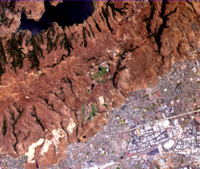

* Remote-sensing hyperspectral imaging
* Radio-interferometric imaging
{:toc}

## Modeling spectral and temporal variabilities in hyperspectral image unmixing

Acquired in hundreds of contiguous spectral bands, hyperspectral (HS) images have received an increasing interest due to the significant spectral information they convey about the materials present in a given scene. However, the limited spatial resolution of hyperspectral sensors implies that the observations are mixtures of multiple signatures corresponding to distinct materials. Hyperspectral unmixing is aimed at identifying the reference spectral signatures composing the data -- referred to as <em>endmembers</em> -- and their relative proportion in each pixel according to a predefined mixture model. In this context, a given material is commonly assumed to be represented by a single spectral signature.

This assumption shows a first limitation, since endmembers may vary locally within a single image, or from an image to another due to varying acquisition conditions, such as declivity and possibly complex interactions between the incident light and the observed materials. Unless properly accounted for, spectral variability can have a significant impact on the shape and the amplitude of the acquired signatures, thus inducing possibly significant estimation errors during the unmixing process.

A second limitation results from the significant size of HS data, which may preclude the use of batch estimation procedures commonly used in the literature, i.e., techniques exploiting all the available data at once. Such computational considerations notably become prominent to characterize endmember variability in multi-temporal HS (MTHS) images, i.e., sequences of HS images acquired over the same area at different time instants.

The main objective of this thesis consists in introducing new models and unmixing procedures to account for spatial and temporal endmember variability. Endmember variability is addressed by considering an explicit variability model reminiscent of the total least squares problem, and later extended to account for time-varying signatures. The variability is first estimated using an unsupervised deterministic optimization procedure based on the Alternating Direction Method of Multipliers (ADMM). Given the sensitivity of this approach to abrupt spectral variations, a robust model formulated within a Bayesian framework is introduced. This formulation enables smooth spectral variations to be described in terms of spectral variability, and abrupt  changes in terms of outliers. Finally, the computational restrictions induced by the size of the data is tackled by an online estimation algorithm. This work further investigates an asynchronous distributed estimation procedure to estimate the parameters of the proposed models.

**Keywords:** Hyperspectral imagery, spectral unmixing, endmember variability, multi-temporal data analysis, Bayesian methods, Markov chain Monte Carlo, (non-)convex optimization, stochastic optimization.

<!-- Advisors -->
**Advisors:**
       <a href="http://www.enseeiht.fr/%7Edobigeon/">Nicolas Dobigeon</a> (University of Toulouse, IRIT/INP-ENSEEIHT, France)
    -- <a href="http://www.enseeiht.fr/%7Etourneret/">Jean-Yves Tourneret</a> (University of Toulouse, IRIT/INP-ENSEEIHT, France).

<figure>
  
  <figcaption>An hyperspectral image (RGB composition).</figcaption>
</figure>

## Time-Regularized Blind Deconvolution Approach for Radio Interferometry

Radio-interferometric imaging aims to estimate a sky intensity image from degraded undersampled Fourier measurements. At the dynamic range of interest to modern radio telescopes, the image reconstruction quality will be limited by the unknown time-dependent calibration kernels. Hence the need to perform joint image reconstruction and calibration, and consequently to solve a non-convex blind deconvolution problem. Extending our recent work where the calibration kernels are assumed to be smooth in space, we further assume in this work that the calibration kernels are smooth in time. In addition, an average sparsity prior is used for the estimation of the image of interest. The resulting high dimensional non-convex non-smooth minimization problem is then solved by leveraging an alternating forward-backward algorithm which benefits from well-established convergence guarantees. Our results show that time-regularization is effective in enhancing imaging quality.

This work has been conducted in collaboration with <a href="https://sites.google.com/view/audreyrepetti">Dr. Audrey Repetti</a>, <a href="https://scholar.google.com/citations?user=FBOb2DAAAAAJ&hl=en">Dr. Arwa Dabbech</a> and <a href="https://www.hw.ac.uk/staff/uk/eps/yves-wiaux.htm">Prof. Yves Wiaux</a>. Further details can be found here .

<figure>
  
  <figcaption>Proposed prior for the calibration kernels.</figcaption>
</figure>